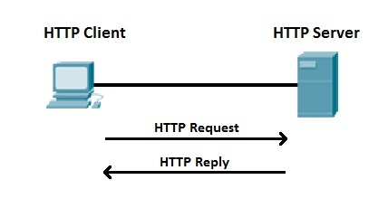
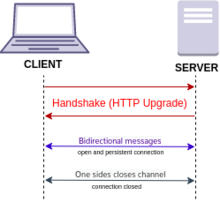

# WebSockets Introduction
## Table of Contents

[Introduction](#introduction)

## Introduction

Traditional HTTP (hypertext transfer protocol) follows a request/response paradigm. The client establishes a connection with the server, and then submits a request via this connection. The server will respond to this request with the appropriate response, and then the connection will close. 

There are several limitations to relying exclusively on this model of communcation. This limitation that we will focus on is in regards to realtime communication. Take a stock trading app as an example. During trading hours, stock prices will constantly be updating on the server. Using the HTTP model, in order to remain in sync with the latest prices, the client will need to perform many requests in rapid succession. However, since the connection closes after each request, we will need to re-establish the connection every time we make a new request, creating a lot of additional overhead.

WebSockets come in handy for addressing this issue. Under this protocol, as with HTTP, the client will establish a connection to the server. However, after a connection is established, it will persist under one side explicitly closes it. While the connection is open, both the server and client will be able to continuously send data back and forth, avoiding the aforementioned overhead.
