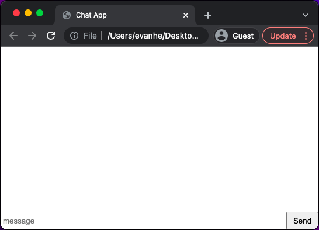

# WebSockets Introduction
## Table of Contents

- [Introduction](#introduction)
- [Example: Chat App](#example-chat-app) 
  - [Server Setup](#server-setup)
  - [Writing Server Code](#writing-server-code)
  - [Writing Client Code](#writing-client-code)
  - [Testing](#testing)
- [Conclusion](#conclusion)
- [Additional Resources](#additional-resources)
## Introduction

Traditional HTTP (hypertext transfer protocol) follows a request/response paradigm. The client establishes a connection with the server, and then submits a request via this connection. The server will respond to this request with the appropriate response, and then the connection will close. 


There are several limitations to relying exclusively on this model of communcation. This limitation that we will focus on is in regards to realtime communication. Take a stock trading app as an example. During trading hours, stock prices will constantly be updating on the server. Using the HTTP model, in order to remain in sync with the latest prices, the client will need to perform many requests in rapid succession. However, since the connection closes after each request, we will need to re-establish the connection every time we make a new request, creating a lot of additional overhead.


WebSockets come in handy for addressing this issue. Under this protocol, the client will establish a connection to the server with an HTTP request. However, after a connection is established, it will persist under one side explicitly closes it. While the connection is open, both the server and client will be able to continuously send data back and forth, avoiding the aforementioned overhead.

## Example: Chat App

We will be further exploring the WebSocket protocol using Socket.io, a JavaScript library that will make setting up realtime two-way connections much easier! Our demo will be a basic implementation of one of the primary uses realtime communication: a chat application.

### Server Setup

As discussed in the introduction, we will need both a server and client to create a socket. Let's set up the server first. Create a new ```server``` folder in your project directory and navigate to it. Then run the following commands:

```
yarn init -y
yarn add socket.io
```

The first command creates the ```package.json``` file that will contain information about our project, and the second command will add ```socket.io``` to ```package.json``` as a dependency of the project. 

### Writing Server Code

With ```socket.io``` correctly set up as a dependency, we can begin writing the code for the server. Create a new ```index.js``` file in the ```server``` folder, and add the necessary imports:

```javascript
const server = require("http").createServer();
const io = require("socket.io")(server, {
  cors: { origin: "*" },
});
```

The code above initializes an http server, and then creates ```io```, a new instance of ```socket.io``` using the server. The ```cors``` object that we initialize enables cross-origin resource sharing (CORS), which will allow any client to request resources from this server. This capability is disabled by default for security purposes, so we need to manually enable it. 

Now we will need to specify how the socket operates. Socket.io is event-driven, meaning that we will produce and consume events as necessary to communicate data. We will implement the socket's event handling as follows:

```javascript
io.on("connection", (socket) => {
  console.log("user connected");
  
  socket.on("message", (msg) => {
    io.emit("message", `${socket.id.substring(0, 3)} said ${msg}`);
  });
  
  socket.on("disconnect", () => {
    console.log("user disconnected");
  });
});
```

The ```connection``` and ```disconnect``` event are predefined for us, so we simply listen for then and print a confirmation once we detect either event. We will later define ```message``` events on our own to trigger when a user submits a chat message. In the server we simply format the message by attaching its author's unique ID before re-emitting the event. It is important to note here that every client connected to the server will be able to receive the formatted message-not just the client the initially sent the message.

Finally we will set the server to listen to port 3000 on our local machine:

```javascript
const port = 3000;
server.listen(port, () => {
  console.log(`listening on port ${port}`);
});
```

### Writing Client Code

Now we will set up the client. Create a new ```client``` folder and an ```index.html``` file inside it. This file is what will ultimately be rendered in the browser. Place the following code in the file:

```html
<!DOCTYPE html>
<html lang="en">
  <head>
    <meta charset="UTF-8" />
    <meta http-equiv="X-UA-Compatible" content="IE=edge" />
    <meta name="viewport" content="width=device-width, initial-scale=1.0" />
    <title>Chat App</title>
    <link rel="stylesheet" href="styles.css" />
  </head>
  <body>
    <ul id="messages"></ul>
    <div class="flex-container">
      <input placeholder="message" />
      <button>Send</button>
    </div>
  </body>
</html>
```

Now add basic styling to the page by adding the ```styles.css``` file from this repository to the ```client``` folder.

At this point, your ```index.html``` file should look like this in the browser:



To load the client, add the following code immediately before the ```</body>``` tag in ```index.html```:

```html
<script src="http://localhost:3000/socket.io/socket.io.js"></script>
```

We can now begin configuring the socket from the client side. Access the client API as follows:

```javascript
const socket = io("ws://localhost:3000");
```

Notice that port 3000 is the same port that we previously set up the server to listen on. Thus the client and server can communicate via the socket on this port. 

The three elements in ```index.html``` that will control the client side of the socket are the ```ul``` element with id ```messages```, the ```input``` element, and the ```button``` element. Select these three elements for ease of use:

```javascript
const messages = document.getElementById("messages");
const input = document.querySelector("input");
const button = document.querySelector("button");
```

When the user clicks the ```button``` element to send a message, we want to communicate the contents of the ```input``` element to the element to the server. Recall that we had already set up consuming a ```message``` event in the server. Here in the client, we simply need to emit the event:

```javascript
document.querySelector("button").onclick = () => {
  const text = input.value;
  console.log(input.value);
  socket.emit("message", input.value);
};
```

The final function that we need to implement is a way to display newly-created messages. Since the server re-emits the ```message``` event after processing it, we can set up the client to also listen for re-emitted events from the server, and create new elements with the data from these events:

```javascript
socket.on("message", (msg) => {
  const item = document.createElement("li");
  item.textContent = msg;
  messages.appendChild(item);
  window.scrollTo(0, document.body.scrollHeight);
});
```

The final line in the callback simply scrolls the display window so that the most recent messages always remain visible.

Finally, to provide ```index.html``` access to the client logic, add the following immediately before the ```</body>``` tag:

```html
<script src="app.js"></script>
```

This completes the implementation of our chat app. 

### Testing

Test the app by first navigating to the ```server``` folder and running the command

```node index.js```

Then, view the ```index.html``` file in the browser. Send a few messages and they should appear on the screen:

You can even open ```index.html``` on a few different tabs to simulate different clients. Sending messages with different clients will result in different IDs appearing on these messages:

## Conclusion
Today we learned about the WebSockets protocol and the benefits that it offers over HTTP in mitigating overhead during realtime communication. As an example, we used the JavaScript Socket.io library implement a basic chat app to illustrate a primary use case for sockets.

To learn more about the WebSockets protocol and Socket.io, check out the links in the  section below. Thank you all so much!

## Additional Resources

- [Websockets API Documentation](https://developer.mozilla.org/en-US/docs/Web/API/WebSockets_API)
- [socket.io Source Code](https://github.com/socketio/socket.io)
- [socket.io-client Source Code](https://github.com/socketio/socket.io-client)
